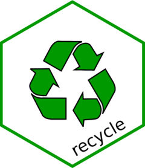

<!-- README.md is generated from README.Rmd. Please edit that file -->
<!-- badges: start -->

[](https://lifecycle.r-lib.org/articles/stages.html#experimental)
<!-- badges: end -->

# recycle 

{recycle} provides a way to set a hook on garbage collection. This is
useful for instance if you want to run a R process periodically. Use
cases might be:

- Notifications
- Logs
- Diagnostics
- Updates

You can’t pick when garbage collection occurs but it is frequent, so the
next best thing is to pick a minimum delta between calls to the hook,
and this is what we do (1 sec by default).

## Installation

Install with:

``` r
remotes::install_github("moodymudskipper/recycle")
```

## Example

``` r
library(recycle)
log <- function() message(sprintf("This R session currently takes %s", capture.output(pryr::mem_used())))

# set the hook and triggers it a first time, use a 1 sec delta by default
recycle(log = new_cycle(log))
#> This R session currently takes 48.8 MB

# doesn't trigger the hook, too soon!
invisible(gc())

Sys.sleep(2)

some_object <- sample(1e6)
# triggers the hook again
invisible(gc())
#> This R session currently takes 53.1 MB
```

We can also run the code in the background in another session by using
`new_cycle_bg()`.

Let’s have a purposeless progress bar widget fill up on garbage
collection.

Run the following example in your session and you should see that your
session is still active while the progress bar is running. Note how the
previous hook is still active.

``` r
fill_pb <- function() {
  pb <- tcltk::tkProgressBar()
  for(i in 1:100) {
    Sys.sleep(0.05)
    tcltk::setTkProgressBar(pb, i/100, sprintf("test (%d%% done)", i))
  }
}
recycle::recycle(pb = new_cycle_bg(fill_pb))
#> This R session currently takes 53.5 MB
x <- 1 # the progress bar is still going on
x
```

We can remove a hook by setting it o `NULL`, e.g. `recycle(log = NULL)`.
If you call `recycle::recycle(new_hook)` your new hook will replace the
old, if you call `recycle::recycle(NULL)` the old hook will be removed.
